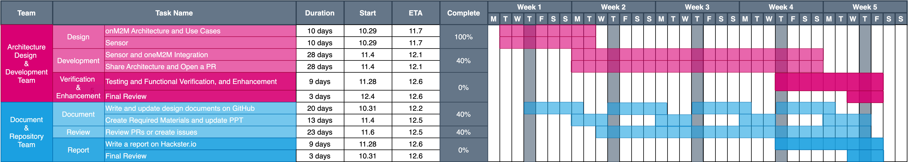

## Overview

This project leverages oneM2M standards to develop a noise cancellation system that mitigates unwanted noise in everyday life. By integrating advanced sensor technologies and smart applications, our system enhances user comfort and improves quality of life.

<br/>

## Features

- **Real-time Noise Detection**: Monitors and detects noise levels in the environment.

- **Smart Noise Cancellation**: Uses speakers and smart algorithms to actively cancel unwanted noise.

- **Seamless Integration with oneM2M**:
  Provides compatibility with oneM2M standards for IoT devices.

- **Cross-Device Support**:
  Works with gateways, smartphones, and other smart devices.

<br/>

## Project Structure

```
├── /docs            # Documentation
├── /entity
      ├── /ADN-AE-1  # Noise Detection Sensor
      ├── /ADN-AE-2  # Noise Cancellation Speaker
      ├── /IN-CSE    # oneM2M gateway
      ├── /MN-CSE    # oneM2M cloud service
      ├── /MN-AE
└── README.md        # Project overview
```

```
git submodule init
git submodule update
```

<br/>

## System Components

1. **Noise Detection Sensor**
   <br/> Detects and quantifies noise levels.

2. **Noise Canceling Speaker**
   <br/> Emits anti-noise to cancel detected noise.

3. **Echo Shield Gateway**
   <br/> Manages resources and processes real-time noise cancellation.

4. **Cloud Service**
   <br/> Uses appropriate adaptive algorithms or calculates the average noise level.

5. **Smartphone Application**
   Provides a user interface to control and monitor the system.

<br/>

## Documentation

Detailed documentation can be found [here](https://github.com/Open-Source-SW/EchoShield/tree/master/docs).

<br/>

## Run

- `ADN-AE` :
  - ADN-AE-1(Noise Detection Sensor):
    ```
    cd entity/ADN-AE-1
    python3 sensor.py
    ```
  - ADN-AE-2(Noise Cancellation Speaker):
    ```
    cd entity/ADN-AE-2
    python3 speaker.py
    ```
- `MN-AE`
  ```
  cd MN-AE
  python3 processor.py
  ```
- `MN-CSE`: check [README.install.md](https://github.com/Open-Source-SW/ACME-gateway/blob/feature/MN-CSE/README.install.md)
- `IN-CSE`: check [README.install.md](https://github.com/Open-Source-SW/ACME-cloud/blob/1cf80c2c9cfa6e0c92183b868dd23295c88e436b/REDME.install.md)

<br/>

## Team Members

- **Architecture Design & Development**: Wooyoung Son, Jungmin Lee
- **Document & Reviewer**: Sujin Hwang, Seunghye Baek

<br/>

## Project Timeline


