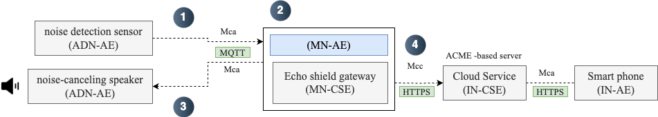

## Process

1. A noise detection sensor detects real-time noise data, and the analog signal is converted into digital data through the sensor's internal ADC (Analog-to-Digital Converter) before being transmitted to the MN-AE.

2. The MN-AE calculates an anti-phase signal using the resource information stored in the MN-CSE and the received noise data. This process is conducted in real-time using MQTT or WebSocket.

3. The calculated phase signal is then converted back into an analog signal and output.
4. The noise data is transmitted to the IN-CSE to be used for appropriate adaptive algorithms or calculating the average noise level.

 
 

## Entity

### `ADN-AE`

- **Noise Emission Actuator**: Outputs random noise data using a library
- **Noise Anti-phase Output Actuator**: Outputs anti-phase signals

### `MN-AE`

- Generates anti-phase data using a Fourier Transform library.
- Operates based on resources registered in the CSE.

### `MN-CSE`

- Develop a local gateway API using ACME (Python)
- Implement the oneM2M resource structure

### `IN-CSE`

- Implement **Registration**, **Discovery**, **Data Management & Repository**, **Subscription & Notification**
- Calculate the average noise level
- Adjust the speaker output level or noise cancellation start value
- Update noise reduction algorithm

### `IN-AE`

- **Adjust noise output level**
- **Adjust noise cancellation start value**: Noise cancellation can start when the noise exceeds a certain threshold.
- **Set noise cancellation time**: Specify times for noise cancellation, such as during sleep or reading, to avoid disturbances.
