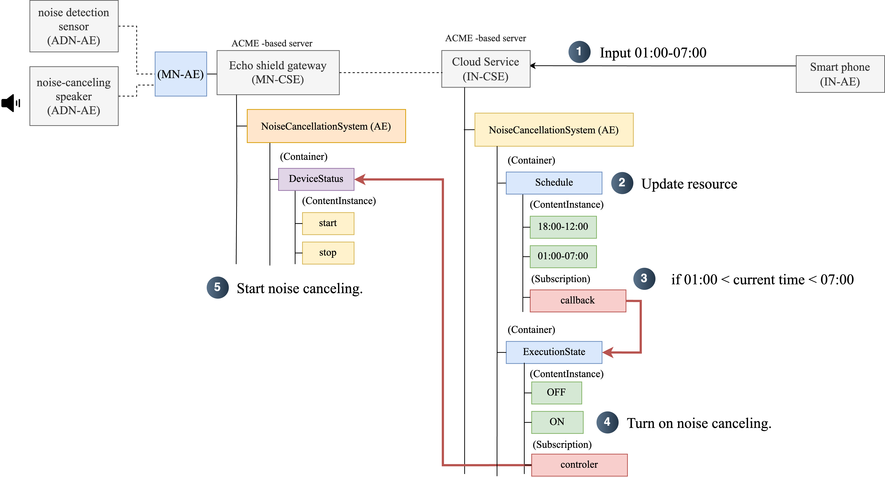

# Resource

### MN-CSE

 
 

### IN-CSE

**The input time format is `HH:MM`**.

# Call Structure

1. The user requests noise cancellation for a specific time period.
2. The cloud service saves the user-defined time period as a resource.
3. When the requested time arrives, the system updates `ExecutionState` to `On`.
4. When `ExecutionState` is updated to `On`, the gateway's `DeviceStatus` is set to `start`.
5. If the latest resource in the `DeviceStatus` container is `start`, noise cancellation begins.

If it is outside the user-requested time period, `ExecutionState` is set to `Off`, and `DeviceStatus` is set to `stop`, halting noise cancellation.
