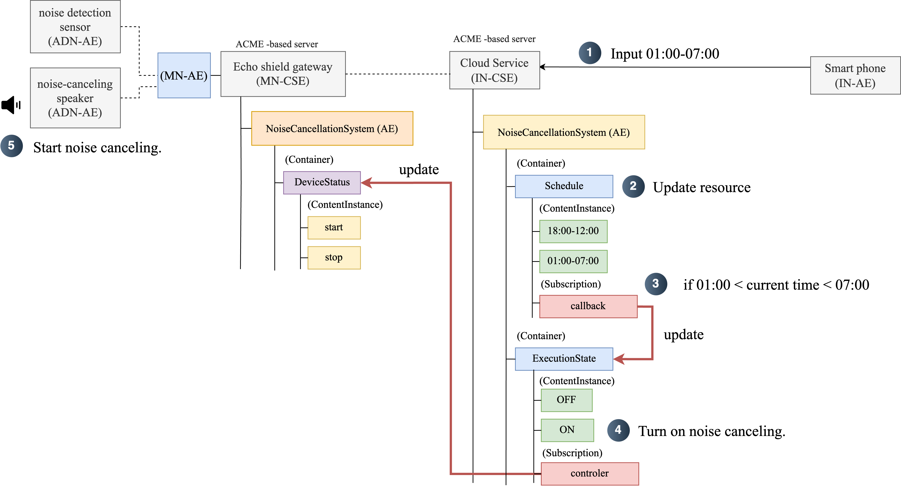

# Resource

### MN-CSE

 
 

### IN-CSE

**The input time format is `HH:MM`**.

 

# Control Noise Cancellation Time

1. The user requests noise cancellation for a specific time period.
2. The cloud service saves the user-defined time period as a resource.
3. When the requested time arrives, the system updates `ExecutionState` to `On`.
4. When `ExecutionState` is updated to `On`, the gateway's `DeviceStatus` is set to `start`.
5. When the `DeviceStatus` changes to 'start,' the speaker`AE` begins noise cancellation processing.

If it is outside the user-requested time period, `ExecutionState` is set to `Off`, and `DeviceStatus` is set to `stop`, halting noise cancellation.

 

# Noise Data Collection

1. The sensor `AE` updates the average noise value collected every hour.
2. Using the CSR, the `IN-CSE` retrieves the average noise data from the `MN-CSE`.
3. The `IN-CSE` stores the retrieved data. This data can be used to provide users with hourly noise levels or to recommend noise cancellation times.
