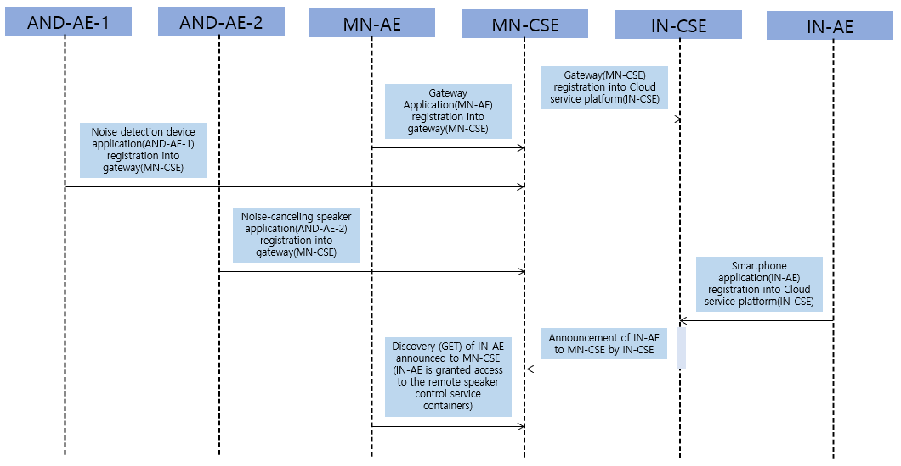
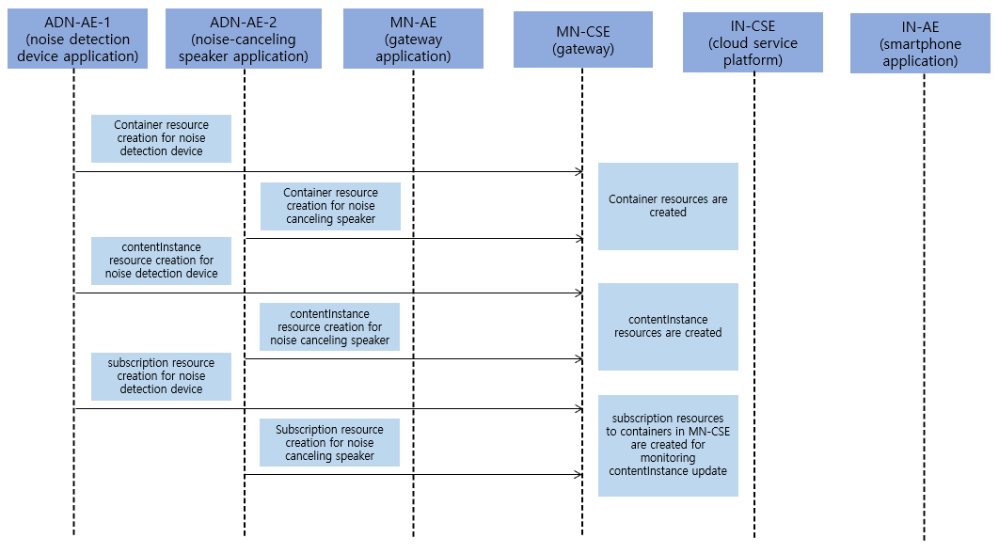
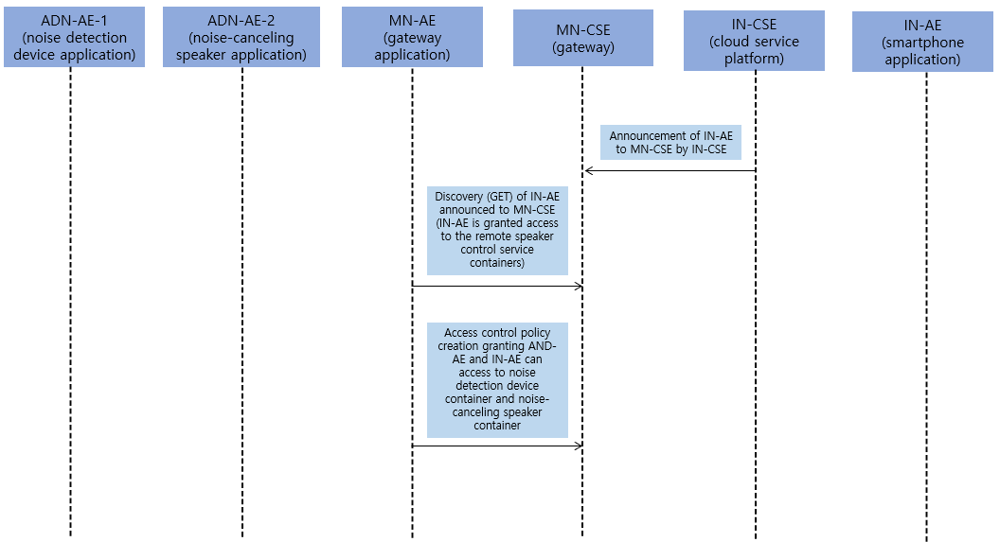
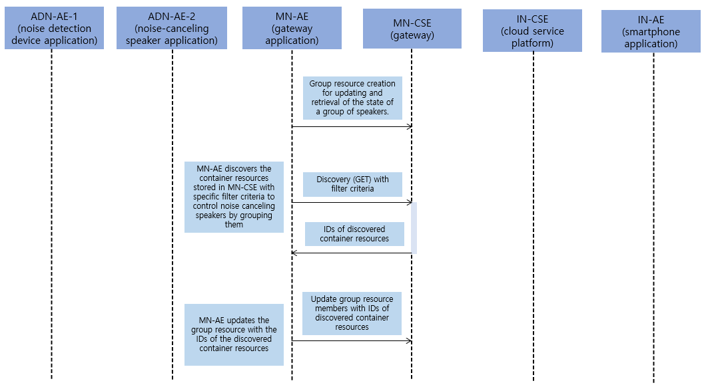
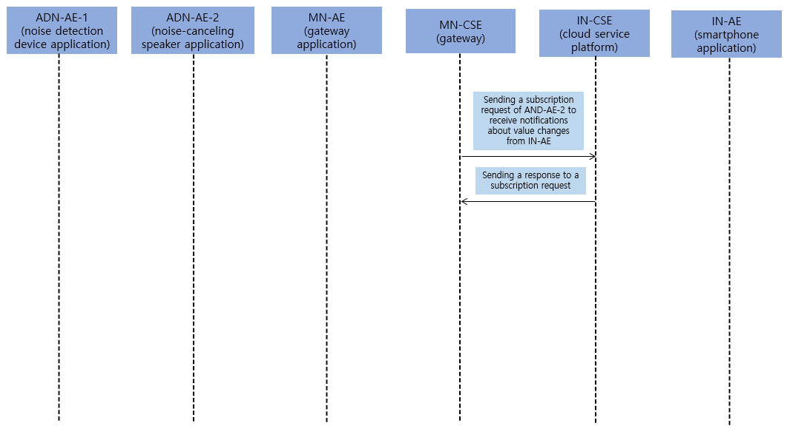
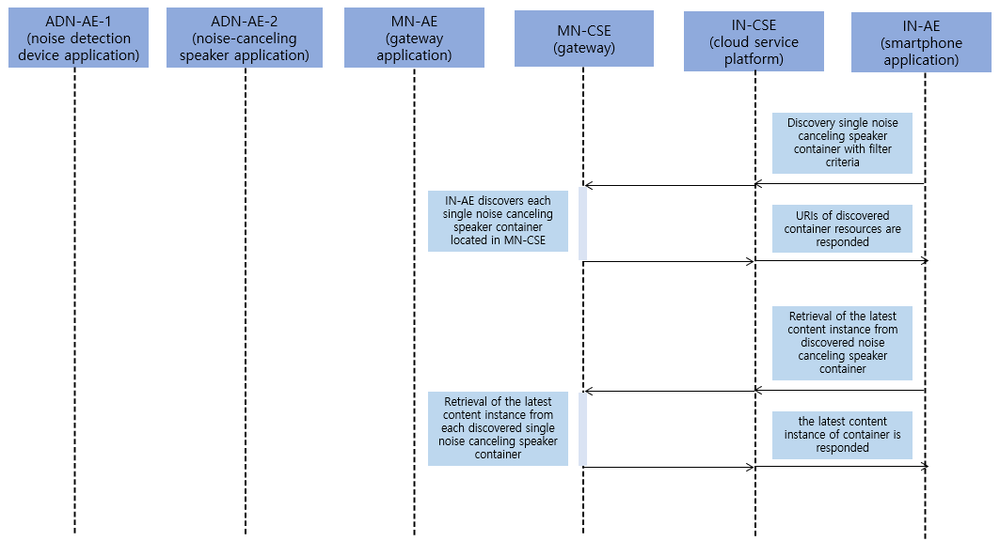
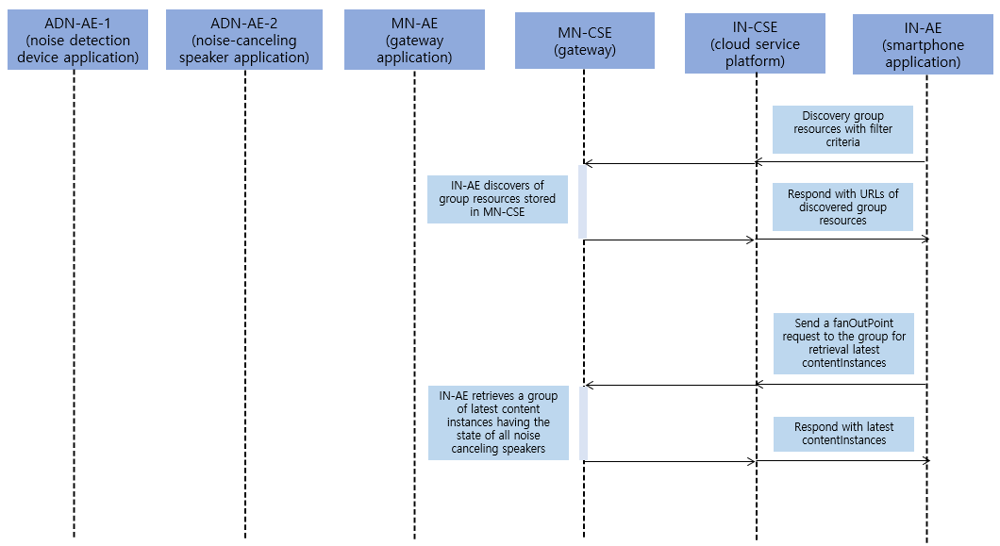
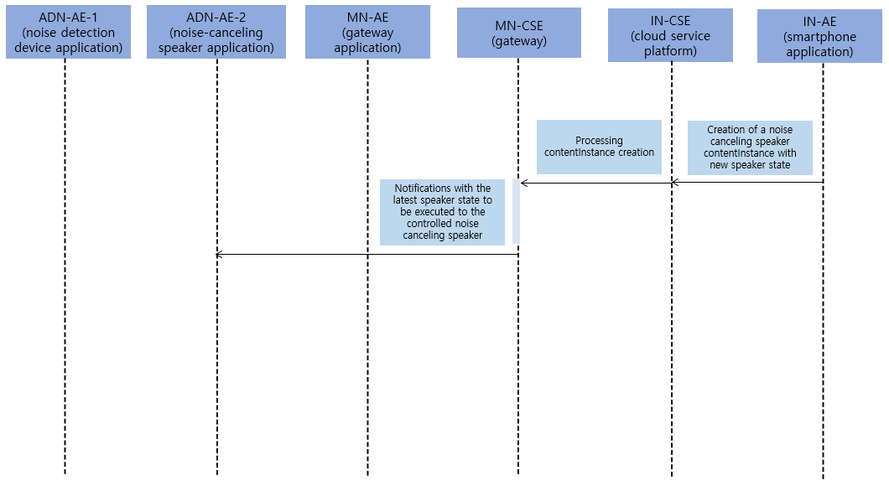

# Call Flow

### Registration

**Registration**: Register the Noise Detection Application, Speaker Application, Gateway Application, and Smartphone Application.

 
 

### Data Management & Repository

**Initial resource creation**:
container resource, contentInstance resource of a specific container resource, subscription resource of a specific container resource, group resource management.

 

### Access Control Policy

**Access Control Policy**:
Access control policy creation granting AND-AE and IN-AE can access to noise detection device container and noise-canceling speaker containe.

 
 

### Data Management & Repository

**Group resource creation**:
Group resource creation, discovery group resources and update group resource members.

 
 

### Subscription

**Subscription**: Subscription setup to receive notifications about value changes from IN-AE.

 
 

### Discovery and Retrieval

**Discovery and retrieve of contentInstance resource**: Discover container resource and retrieve the contentInstance resource of a specific container resource
The purpose is to ensure the latest state is updated for the user to view and control devices efficiently.

 

**Discovery and retrieve of group resource**:
Discover the group resource and retrieve the contentInstance resource of group resources
The purpose is to ensure the latest state is updated for the user to view and control devices efficiently.

 
 

### Resource update(Notification)

**Single speaker remote control**: Single speakers that are discovered are able to be switched on and off via a smartphone application and send notifications.

 

**Multiple speaker remote control**: Multiple speakers that are discovered are able to be switched on and off via a smartphone application and send notifications.
