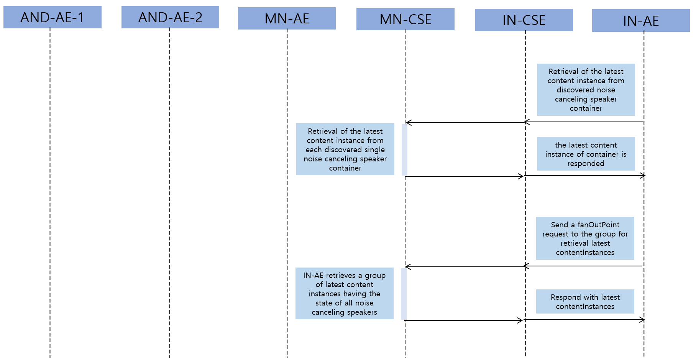
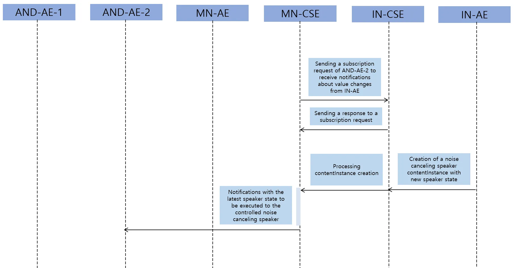
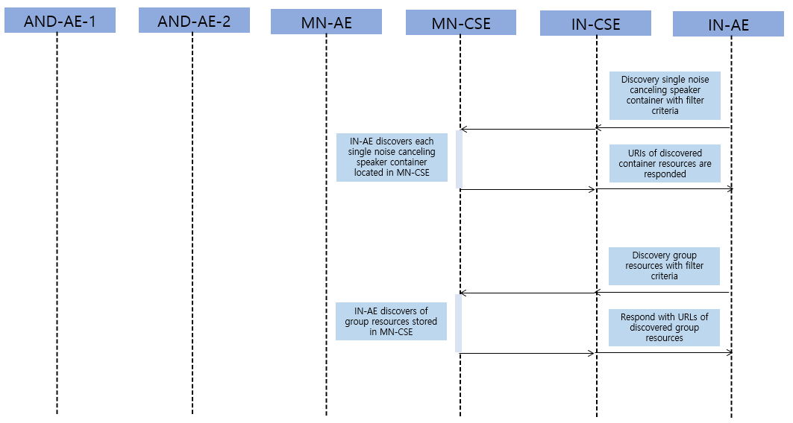
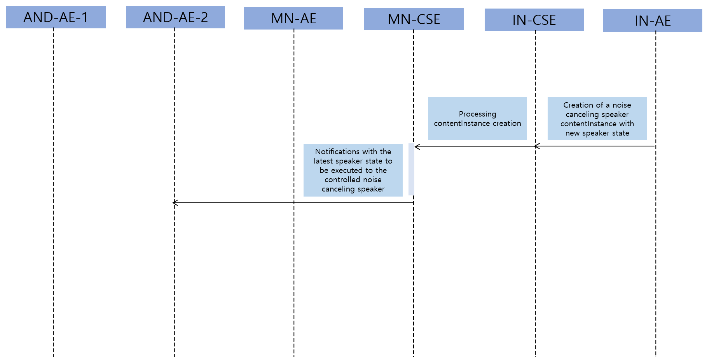
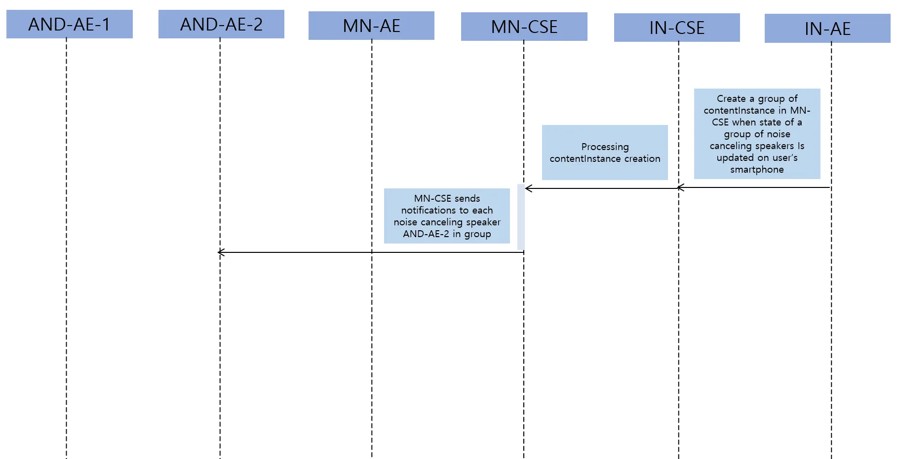

# Call Flow

### Registration

**Registration**: Register the Noise Detection Application, Speaker Application, Gateway Application, and Smartphone Application.

 
 

### Data Management & Repository

**Initial resource creation**:
container resource, contentInstance resource of a specific container resource, subscription resource of a specific container resource, group resource management

 

**Resource retrieval**:
Retrieve the container resource, contentInstance resource of a specific container resource

 
 

### Subscription & Notification

**Subscription/notification and single speaker remote control**:
When the contentInstance resource of a specific container is updated, notification is sent to the subscribing application

 
 

### Discovery

**Discover resource**: Discover the group resource and container resource

 
 

### Resource update

**Single speaker remote control**: Single speaker that are discovered are able to switched on and off a smartphone application.

 

**Multiple speaker remote control**: Multiple speaker that are discovered are able to switched on and off a smartphone application.
